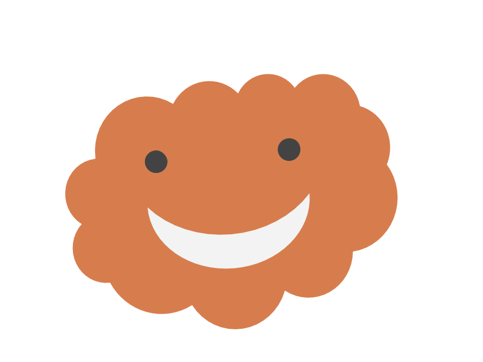

    
    <h3 align=center>Conquer the World's Challenges together</h3>

    
    <a target="_blank" href="https://www.python.org/downloads/" title="Python version">= 3.6" src="https://img.shields.io/badge/python-%3E=_3.6-green.svg"></a>
    

# About
Stratus is a Web Platform that aims to connect organizations directly with developers to find solutions and make real world impact. It was built in response to the year 2020... what a year. This year has revealed the most vurnable out of all of us, and has left the rest of us with much stronger will to HELP, and MAKE AN IMPACT. With the world shifting online, developers are becoming a nessecity in any organization. However, it is often the organizations with the least reasources, that are in need of developers. Stratus, was created to directly link these organizations with up and coming developers, who are in need of experience, and who's skill's could level up any organization.  

The driving functionality of Stratus are the challenge pages. If an organization is in need of a piece of software, a website, or maybe even some ideas, they can post a challenge prompt on a Challenge page, tag all the nessary skills, difficulties, and urgencies that relate to the challenge. Developers will then be able to view these challenges and make projects according to the organization's needs. This way, the organization can connect with developers looking to make an impact, and the developers will get the experience they need to build their skills and progress in their career.

*This project was made for KuriusHacks 2020 by [TheAvidDev](https://github.com/TheAvidDev/), [dulldesk](https://github.com/dulldesk/), [skyflaren](https://github.com/skyflaren/), and [aavaSapkota](https://github.com/aavaSapkota).*

# Features
 - Challenge pages where organizations post challenge prompts.
 - Project postings where developers can join projects.
 - Tasks associated with each project which act as a to-do list for contributing developers.
 - Tags act as labels that projects, challenges, and users can assoicate themselves with to be apart of those communities.
 - Badges awarded to developers for completing challenges.
 - Community heatmap where developers can see other contributors in their area, fostering a sense of community.
 - And so much more!
