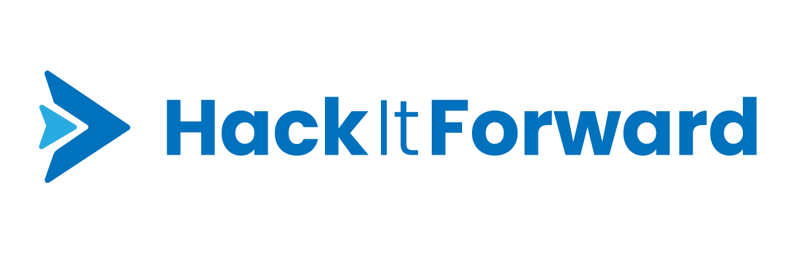

<p align=center>
    
    <h3 align=center>Conquer the World's Challenges together</h3>
</p>
<p align=center>
    
    <a target="_blank" href="https://www.python.org/downloads/" title="Python version">= 3.6" src="https://img.shields.io/badge/python-%3E=_3.6-green.svg"></a>
    
</p>

# About

With the world shifting online as a result of the pandemic, developers are becoming an increasing necessity in any organization. However, during this period, many organizations with limited resources, most often nonprofits, are struggling with this difficult transition. HackItForward was created to help these organizations tackle their problems, by offering up-and-coming developers a platform to work on real-world projects and make a meaningful impact on society.

The driving functionality of HackItForward are the challenges. These come in varying levels of difficulty and requirements. As a general guideline, there are two main types of challenges, tutorial challenges and real-world challenges:

1. With the intent of being beginner-friendly, tutorial challenges displayed on the platform are permanent, learning-focused and have the primary purpose of educating programmers. They act as tutorials to walk developers through the creation of a project from start to finish.

2. On the other hand, real-world challenges are impact-focused and time-constrained. They give an opportunity for developers to build their programming skills, obtain real-world experience, progress in their careers and help society along the way. The best projects submitted for these challenges are likely to be implemented by the organizations.


# Running the project locally

1. Installing the required packages and setting up the local database
```
pip install -r requirements.txt
python manage.py migrate
python manage.py loaddata users
python manage.py loaddata tags
python manage.py loaddata social_links
python manage.py loaddata challenges
python manage.py loaddata projects
```
2. To start the Django server, run `python manage.py runserver`

**Note**: You should do this in a Python [virtualenv](https://virtualenv.pypa.io/en/stable/) or similar alternative.

# Features

 - Challenge pages where organizations post challenge prompts.
 - Project postings where developers can join projects.
 - Tasks associated with each project which act as a to-do list for contributing developers.
 - Tags act as labels that projects, challenges, and users can assoicate themselves with to be apart of those communities.
 - Badges awarded to developers for completing challenges.
 - Community heatmap where developers can see other contributors in their area, fostering a sense of community.
 - And so much more!

 *This project was initially made for [KuriusHacks 2020](https://www.kurius.ca/kuriushacks) by [TheAvidDev](https://github.com/TheAvidDev/), [dulldesk](https://github.com/dulldesk/), [skyflaren](https://github.com/skyflaren/), and [aavaSapkota](https://github.com/aavaSapkota), and was awarded first place at the end of the hackathon.*
